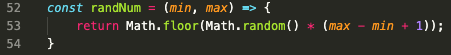
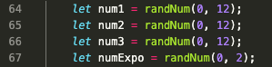
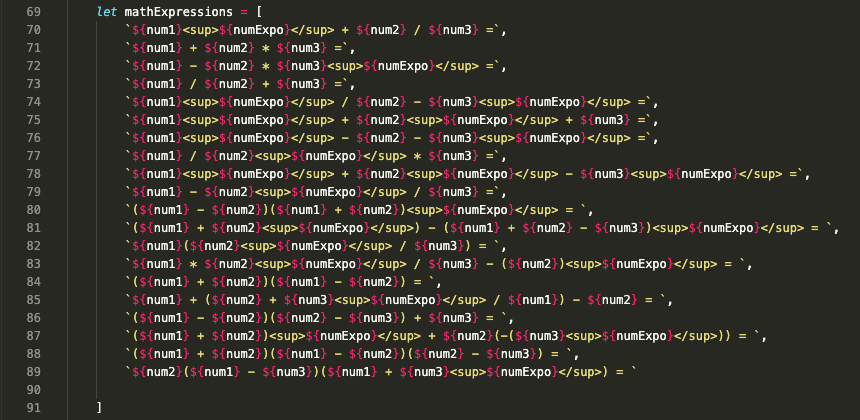
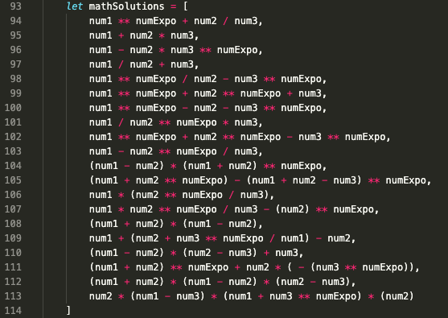
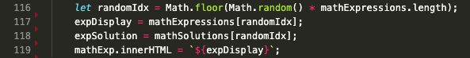

# Party With Professor PEMDAS

## WireFrame

## Overview
Party with Professor PEMDAS is a problem-solving game. Mathematical expressions will appear on the game board and to the user needs correctly to solve each expression using the mathematical principles of PEMDAS (also known as the Order of Operations).

PEMDAS, also written as PE[MD][AS], is an acronym that stands for (P)arentheses, (E)xponents, [(M)ultiplication and (D)ivision], [(A)ddition and (S)ubtraction]. It lists the order in which mathematical operations should be solved in any given expression.

I currently hold a degree in Mathematical Sciences (Applied Mathematics). I was also a Math teacher for some time. During my time as a Math teacher, I noticed that most of the time, students had issues with basic principles, such as PEMDAS. I created this game as a practice tool for those who struggle with such principles.

## Game Rules
* Accurately calculate the expressions that will show up on the page, using PEMDAS (Order of operations), within the time given.
* Player wins 1 point if you answer correctly.
* Professor PEMDAS wins 1 point if:
    * player answers incorrectly.
    * player doesn't enter the answer within the allotted time.
    * player enters something that is not a number (Infinity is a number and therefore can be entered).
* Player also loses 1 point if time runs out.
* Player's allotted time decreases by 5 seconds with each answer entered; decrement stops once allotted time reaches 15 seconds per problem.
* If player get 10 correct, game over; they win the game.
* If Professor PEMDAS gets to 10, game over; player loses the game.

## User Stories
* When player clicks "Start" button, a random expression will appear onscreen with randomly generated numbers (0 to 12).
* When player inputs possible answer into input field and clicks the "Submit" button:
    * input is compared to correct answer.
    * correct answer gets displayed on browser.
    * if answer is correct:
        * player gets 1 point added to score.
        * message appears stating that the answer is correct.
    * if answer is incorrect:
        * Professor PEMDAS gets 1 point.
        * message appears stating that the answer is incorrect.
    * "Submit" button is disabled.
* When player clicks the "Next" button:
    * a new expression to appear on screen.
    * a new timer to start if time is more than 15 seconds.
    * messages are cleared.
    * correct answer display is cleared.
    * Submit button is enabled.
* When player clicks the "Reset" button, all game elements are set back to their original settings:
    * timer goes back to 40 seconds.
    * Scoreboards goes back to 0 per player.
    * all messages are cleared.
    * mathematical expressions are cleared.

## MVP Checklist
* Functioning buttons:
    * "Start" button starts timer, generates random expression with random numbers.
    * "Next" button generates next mathematical expression
    * "Submit" button takes user input and compares it to correct answer; affects scoreboard accordingly.
    * "Reset" button that fully resets game.
* A timer that decrements by 1.
* Scoreboard that adds 1 to player score if answer is correct; adds 1 to Prof. PEMDAS score if incorrect.
* Game Rules and PEMDAS rules on the screen.

## Stretch Goals
* CSS
* Decrement timer by 5 seconds (until time per problem is 15 seconds) when "Next" button is clicked.
* Time's Up function that removes 1 point from player score (once the player has more than 0 points) and adds 1 point to Professor PEMDAS' score.
* Add conditional: if player inputs anything that isn't a number, Professor PEMDAS gets 1 point.
* Display correct answer on browser when player submits their answer.
* Disable and Enable submit button.
* Update Professor image with games status.

## Technologies Used
* git (Terminal)
* GitHub
* GitHub pages
* Visual Studio Code
* Google Chrome DevTools

## Sources
* javascript.info
* w3schools.com
* Google images
* Google Web Fonts

## Code Snippets

### Random Number Generator
This is the function used to randomly generated numbers between 2 parameters (min and max). When this function is called within the randon Expression Generator with min and max selected, it generates numbers between the min and max values, including the min and max themselves.

### Math Expressions Array
This is an array within the Random Expression function (generates Random expressions with random numbers). Notice how it is written in HTML markup (ie:  tags). It is written this way so that when the expression is displayed on the browser, it has maximum user readability.

### Math Solutions Array
This is another array within the Random Expression function. They are the computational equivalent of the Math Expressions Array. Each index of this array returns a numeric value that matches with that of the expression array. This array is crucial for comparing the user's answer to that of the correct one.

### Random Expression Generator
This final part of the Random Expression function randomly picks an expression from the Expressions array, its corresponding solution, and displays the picked expression onto the browser.

