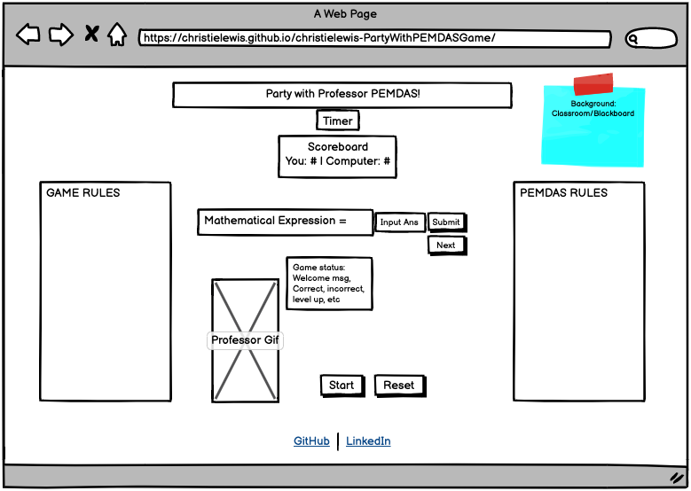

# christielewis-PartyWithPEMDASGame

### Overview
* 1.
* 2.

### Game Rules
* 1. Accurately calculate the expressions that will show up on the page, using PEMDAS (Order of operations), within the time given.
* 2. Expressions start as 3 ramdomly generated numbers with 2 operations.
* 3. Computer wins a point if you don't enter the answer within the time given.
* 4. Get 1 correct, your count goes up by 1. Get it incorrect, the computer wins and it's count goes up by 1.
* 5. You get less time with each question answered correctly.
* 6. Get 5 correct, the experssions become harder (4 randomly generated numbers with 3 operations).
* 7. Get 10 correct, game over; you win the game.
* 8. If the computer gets to 10, game over; you lose the game.

### User Stories
* 1. Player will click "Start" button.
* 2. A random expression will appear onscreen with randomly generated numbers (0-12).
* 3. Player has to input answers into input fields and click "Submit" button to submit answer.
* 4. Player has to click "Next" button for a new expression to appear on screen and a new timer to start.
* 5. Player can click "Reset" button to reset game.